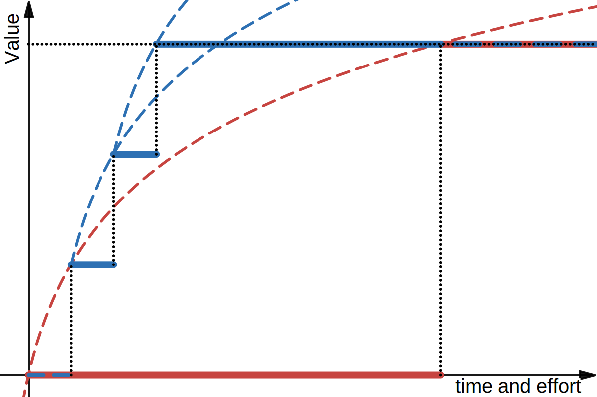

# The Change Curve 

There is extensive research and real-world evidence showing that small, incremental changes lead to faster and more reliable progress. This principle is indeed central to Agile methodologies, and has been validated across many contexts:

- The Lean Startup methodology emphasizes small, rapid experiments ([Eric Ries' Lean Startup](https://theleanstartup.com/principles))
- Amazon's "two-pizza teams" show how small, autonomous units move faster ([AWS Documentation on Two-Pizza Teams](https://docs.aws.amazon.com/whitepapers/latest/introduction-devops-aws/two-pizza-teams.html))
- Google's research on high-performing teams found that small, focused changes were key to improvement ([Google re:Work](https://rework.withgoogle.com/))
- The DevOps Handbook details how small batch sizes accelerate delivery ([DevOps Handbook](https://itrevolution.com/product/the-devops-handbook/))

However, especially with process changes, people often still want to build and execute large changes. I want to add to the argument by using a visualization that helps demonstrate why we can move faster by making smaller changes.

## The Change Curve

The time and effort needed to prepare and execute a change grows exponentially with its size. The exponential relationship between change size and effort can be explained by six key factors:

1. **Interaction Complexity**
When components interact, complexity grows exponentially. Each new component creates connections with all existing ones, following mathematical patterns where interactions grow as N², N³ and beyond. Dependency chains become increasingly complex, and edge cases multiply as components interact in unexpected ways.

2. **Testing and Validation**
Testing burden grows dramatically with change size. Beyond testing individual changes, we must test how changes work together, creating a combinatorial explosion of test cases. Regression and integration testing become more complex as the change surface grows. Edge cases multiply, requiring more sophisticated test scenarios.

3. **Communication Overhead**
Communication complexity follows Metcalfe's Law, growing quadratically with stakeholder count. Each new stakeholder creates channels with every existing participant, meaning more meetings, documentation, and alignment time. The information that needs to be shared grows exponentially.

4. **Risk and Uncertainty**
Larger changes introduce more variables and assumptions. Each new component adds potential failure points that need management. More stakeholders need consultation, more contingencies need development, and more unknowns need consideration. The uncertainty compounds as factors interact.

5. **Coordination Costs**
As changes grow, coordination burden increases dramatically. More teams need schedule alignment, more dependencies need management, and more conflicts need resolution. Documentation requirements expand, and handoffs between teams multiply with each new component added.

6. **Feedback Loops**
Getting and acting on feedback becomes harder as changes grow larger. Small changes enable quick feedback and course correction, while larger changes obscure what's working. Learning from mistakes becomes more difficult, and assumption validation takes longer. Change complexity clouds visibility into progress.

These factors don't just add up - they compound on each other, creating an exponential growth in effort and time required as changes grow larger. Giving us a curve that looks like this:

If we want to deliver a small change, we can do it very fast, but as we increase the size of the change, the time and effort required grows exponentially compared to the value delivered. A small change delivers most of its value quickly, while a large change requires massive investment before seeing results.

## Use the curve don't fight it

If we instead follow everyones addvice and do small changes, we always stay to the left side of the curve.

This image shows how making several small changes (blue line) requires less total time/effort than one large change (red line) to achieve the same end result. The small changes can be made in sequence, with each one building on the lessons learned from the previous changes. We get value from each small improvement rather than waiting for everything to be perfect.

### Turn the ship
Let's take an analogy of turning a large ship around.

#### Break and Fix strategy
Just turn that wheel and we'll be turned around in no time! But when you turn, all the stuff in the kitchen gets thrown off the tables, some of your guests fall down and get hurt and need medical attention. So while you made the turn quickly, you spend a large amount of time cleaning up the mess you made.

#### Plan for a smooth turn
So the next time you have to turn around, you plan ahead. You cancel dinner and have the kitchen staff strap down all the dishes. You tell all the guests to sit down and brace themselves. You go through the ship with staff and make sure everyone is seated safely, and then you do the big turn! And for the most part things go well. You missed one passenger that was in the bathroom and they hit their head, and a staff member had taken some plates to their room for dinner and those smashed - but much better, right?

#### Make small turns
But what if we just turn 10 degrees and see what happens? Well, we did have a plate fall, so the next time we do 5 degrees and everything is smooth, so we keep turning at this rate until the ship is turned around. The small turn took less prep and broke less, so we were able to finish the turn much faster.

Each small turn takes on less risk and gives us information about the effects of our actions. This is the essence of the change curve in practice - by making smaller changes, we can learn and adapt more quickly while minimizing disruption.

## Conclusion

Making small changes lets us spend less time planning and more time doing and evaluating, where the real value exists. When we make small changes:

1. We can start delivering value immediately rather than waiting for a perfect plan
2. We learn from each change and apply those lessons to future changes
3. We can course-correct quickly if something isn't working
4. The reduced risk means we spend less time planning for contingencies
5. We maintain momentum by seeing regular progress
6. We can better measure and attribute the impact of each change
7. Teams stay engaged because they see constant improvement
8. We build confidence through repeated small successes

The focus shifts from extensive upfront planning to rapid iteration and learning. This creates a virtuous cycle where each successful small change builds organizational trust and capability for future changes.

